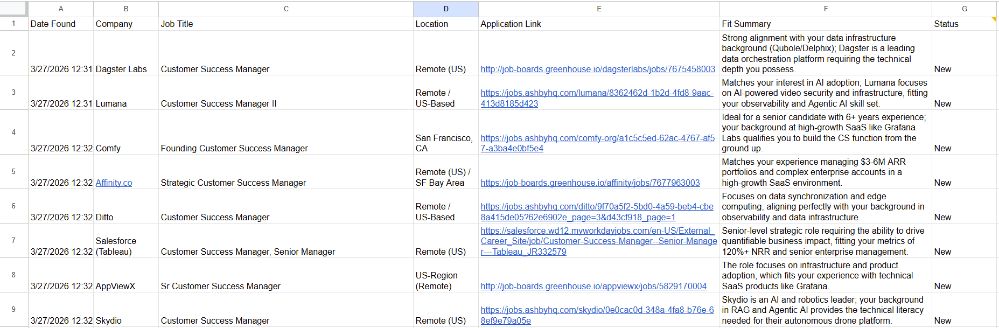

Project Prana: Job Pulse Agent ⚡
An automated, AI-native job discovery and vetting system built with Google Apps Script and Gemini 3 Flash. This agent performs daily "Big Net" scans across Tier-1 Applicant Tracking Systems (ATS) to surface high-signal career opportunities tailored to specific enterprise performance metrics.

🚀 The Problem
Modern job boards are saturated with stale listings, "promoted" noise, and roles that don't align with senior-level enterprise experience. Manual searching is a bottleneck for high-impact candidates.

🧠 The Solution: Agentic Vetting
The Job Pulse Agent automates the entire top-of-funnel discovery process using a four-stage pipeline:

Ingestion: Scans Greenhouse, Lever, Ashby, Y Combinator, and Workday via the Serper.dev API.

State Persistence: Uses Google’s UserProperties to implement a "Memory" layer, ensuring every role is vetted once and never repeated.

LLM Synthesis: Leverages Gemini 3 Flash Preview to evaluate role descriptions against specific candidate benchmarks:

Financial Scope: Experience managing $3–6M in ARR.

Retention Metrics: Proven track record of 95% GRR and 120%+ NRR.

Domain Alignment: Specialization in Observability (Grafana), Data Infrastructure (Delphix), and Agentic AI/RAG.

Reporting: Delivers a daily HTML digest to Gmail and populates a Google Sheets CRM with a live application pipeline.

🛠️ Tech Stack
Engine: Google Apps Script (GAS)

LLM: Gemini 3 Flash (v1beta endpoint)

Search: Serper.dev (Google Search API)

CLI: @google/clasp for local development and CI/CD

Database: Google Sheets API + PropertiesService (for state and secrets)

🔒 Security & Best Practices
This repository follows enterprise-grade security standards for cloud scripts:

Secret Management: No API keys are hardcoded. All credentials (SERPER_API_KEY, GEMINI_API_KEY) are stored in Google Script Properties.

Environment Isolation: Local development is managed via .clasp.json (ignored in .gitignore) to prevent unauthorized cloud pushes.

⚙️ Setup & Deployment
Clone the Repo:

Bash
git clone https://github.com/edandapa/project-prana.git
cd job-pulse-agent
Install Dependencies:

Bash
npm install -g @google/clasp
clasp login
Configure Script Properties:
In the Google Apps Script editor, add the following to Project Settings:

SERPER_API_KEY: Your Serper.dev key.

GEMINI_API_KEY: Your Google AI Studio key.

SHEET_ID: The ID of your tracking spreadsheet.

Push and Initialize:

Bash
clasp push
Run setupSheet() once in the editor to initialize the CRM headers and "Status" dropdowns.

